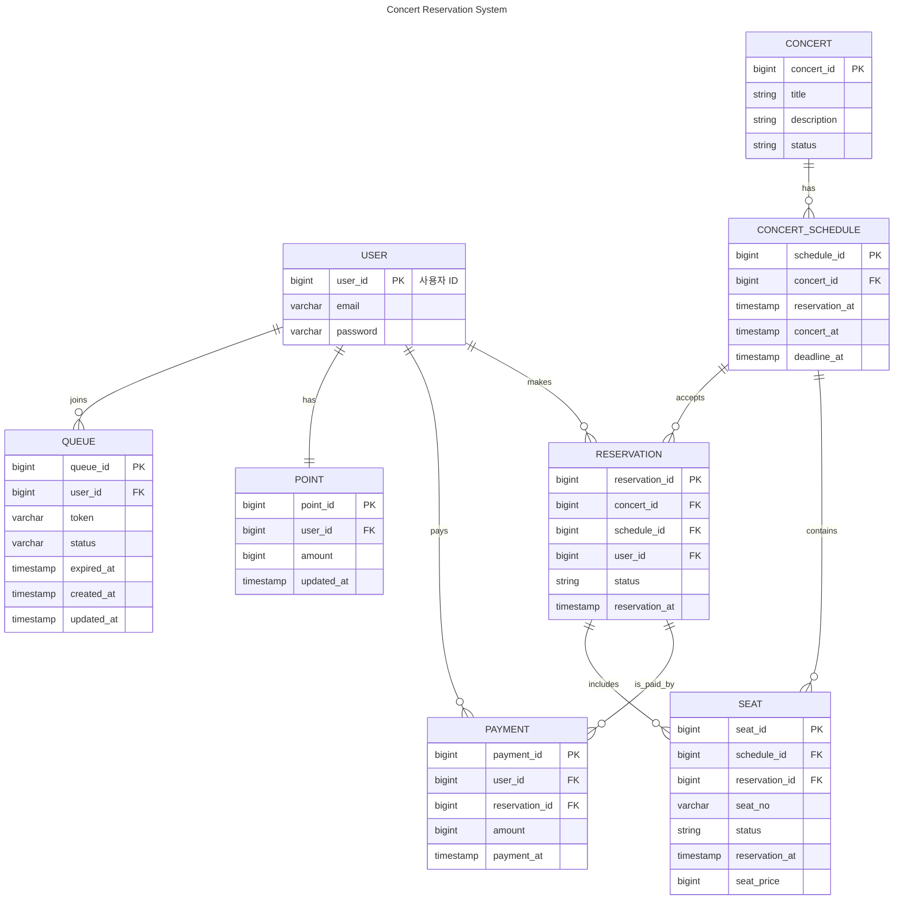

```mermaid
---
title : Concert Reservation System 
---

erDiagram

    USER {
        bigint user_id PK "사용자 ID"
        varchar email
        varchar password
    }

    QUEUE {
        bigint queue_id PK
        bigint user_id FK
        varchar token
        varchar status
        timestamp expired_at
        timestamp created_at
        timestamp updated_at
    }

    POINT {
        bigint point_id PK
        bigint user_id FK
        bigint amount
        timestamp updated_at
    }

    PAYMENT {
        bigint payment_id PK
        bigint user_id FK
        bigint reservation_id FK
        bigint amount
        timestamp payment_at
    }

    RESERVATION {
        bigint reservation_id PK
        bigint concert_id FK
        bigint schedule_id FK
        bigint user_id FK
        string status
        timestamp reservation_at
    }

    CONCERT {
        bigint concert_id PK
        string title
        string description
        string status
    }

    CONCERT_SCHEDULE {
        bigint schedule_id PK
        bigint concert_id FK
        timestamp reservation_at
        timestamp concert_at
        timestamp deadline_at
    }

    SEAT {
        bigint seat_id PK
        bigint schedule_id FK
        bigint reservation_id FK
        varchar seat_no
        string status
        timestamp reservation_at
        bigint seat_price
    }

%% Relationships

USER ||--o{ RESERVATION : "makes"     
USER ||--o{ PAYMENT : "pays"              
USER ||--|| POINT : "has"                 
USER ||--o{ QUEUE : "joins"               

CONCERT ||--o{ CONCERT_SCHEDULE : "has"   
CONCERT_SCHEDULE ||--o{ SEAT : "contains" 
CONCERT_SCHEDULE ||--o{ RESERVATION : "accepts" 

RESERVATION ||--o{ PAYMENT : "is_paid_by" 
RESERVATION ||--o{ SEAT : "includes"
```