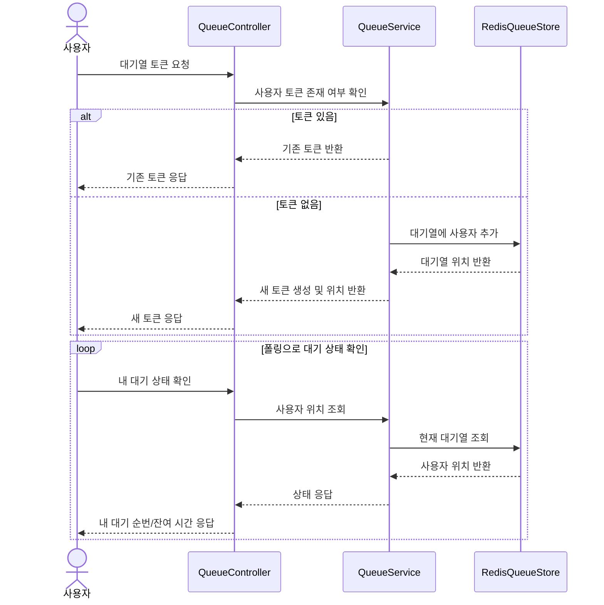
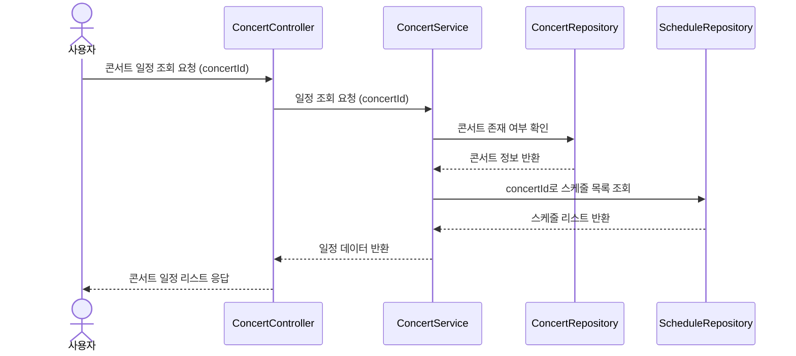
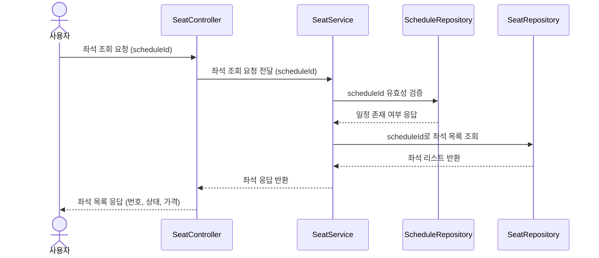
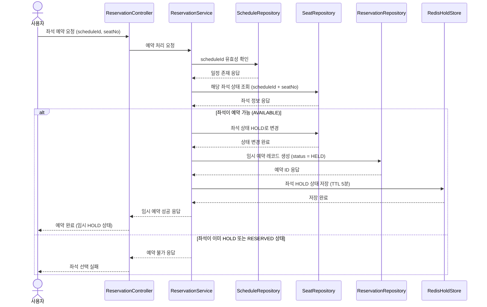
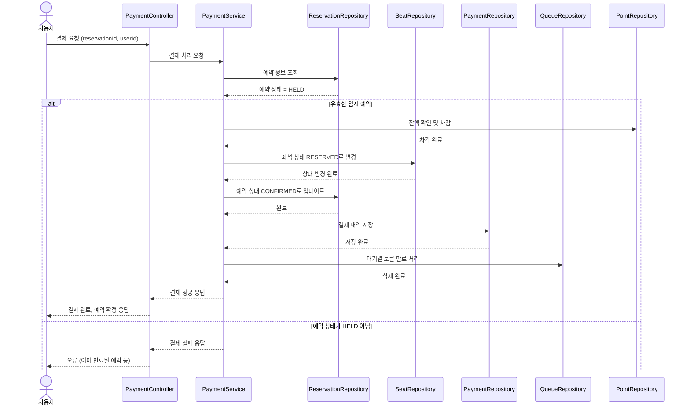
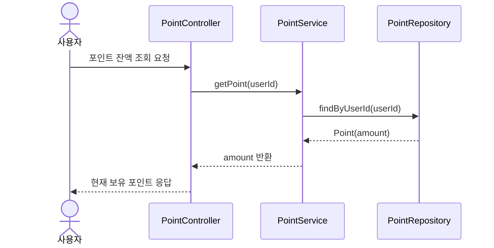
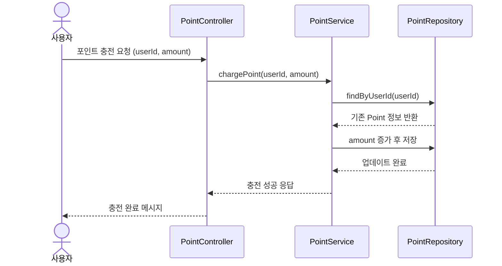

## **시퀀스다이어그램** :

## 대기열 토큰

```mermaid
sequenceDiagram
    actor User as 사용자
    participant API as QueueController
    participant Service as QueueService
    participant Redis as RedisQueueStore

    User->>API: 대기열 토큰 요청
    API->>Service: 사용자 토큰 존재 여부 확인
    alt 토큰 있음
        Service-->>API: 기존 토큰 반환
        API-->>User: 기존 토큰 응답
    else 토큰 없음
        Service->>Redis: 대기열에 사용자 추가
        Redis-->>Service: 대기열 위치 반환
        Service-->>API: 새 토큰 생성 및 위치 반환
        API-->>User: 새 토큰 응답
    end

    loop 폴링으로 대기 상태 확인
        User->>API: 내 대기 상태 확인
        API->>Service: 사용자 위치 조회
        Service->>Redis: 현재 대기열 조회
        Redis-->>Service: 사용자 위치 반환
        Service-->>API: 상태 응답
        API-->>User: 내 대기 순번/잔여 시간 응답
    end

```
## 예약 가능 날짜 / 좌석 API
### 예약 가능 날짜

```mermaid
sequenceDiagram
    actor User as 사용자
    participant API as ConcertController
    participant Service as ConcertService
    participant ConcertRepo as ConcertRepository
    participant ScheduleRepo as ScheduleRepository

    User->>API: 콘서트 일정 조회 요청 (concertId)
    API->>Service: 일정 조회 요청 (concertId)
    Service->>ConcertRepo: 콘서트 존재 여부 확인
    ConcertRepo-->>Service: 콘서트 정보 반환

    Service->>ScheduleRepo: concertId로 스케줄 목록 조회
    ScheduleRepo-->>Service: 스케줄 리스트 반환

    Service-->>API: 일정 데이터 반환
    API-->>User: 콘서트 일정 리스트 응답
```

### 예약 가능 좌석

```mermaid
sequenceDiagram
    actor User as 사용자
    participant API as SeatController
    participant Service as SeatService
    participant ScheduleRepo as ScheduleRepository
    participant SeatRepo as SeatRepository

    User->>API: 좌석 조회 요청 (scheduleId)
    API->>Service: 좌석 조회 요청 전달 (scheduleId)

    Service->>ScheduleRepo: scheduleId 유효성 검증
    ScheduleRepo-->>Service: 일정 존재 여부 응답

    Service->>SeatRepo: scheduleId로 좌석 목록 조회
    SeatRepo-->>Service: 좌석 리스트 반환
    Service-->>API: 좌석 응답 반환
    API-->>User: 좌석 목록 응답 (번호, 상태, 가격)

```

## 콘서트 예약 신청 및 임시 예약 

```mermaid
sequenceDiagram
    actor User as 사용자
    participant API as ReservationController
    participant Service as ReservationService
    participant ScheduleRepo as ScheduleRepository
    participant SeatRepo as SeatRepository
    participant ReservationRepo as ReservationRepository
    participant Redis as RedisHoldStore

    User->>API: 좌석 예약 요청 (scheduleId, seatNo)
    API->>Service: 예약 처리 요청

    Service->>ScheduleRepo: scheduleId 유효성 확인
    ScheduleRepo-->>Service: 일정 존재 응답

    Service->>SeatRepo: 해당 좌석 상태 조회 (scheduleId + seatNo)
    SeatRepo-->>Service: 좌석 정보 응답

    alt 좌석이 예약 가능 (AVAILABLE)
        Service->>SeatRepo: 좌석 상태 HOLD로 변경
        SeatRepo-->>Service: 상태 변경 완료

        Service->>ReservationRepo: 임시 예약 레코드 생성 (status = HELD)
        ReservationRepo-->>Service: 예약 ID 응답

        Service->>Redis: 좌석 HOLD 상태 저장 (TTL 5분)
        Redis-->>Service: 저장 완료

        Service-->>API: 임시 예약 성공 응답
        API-->>User: 예약 완료 (임시 HOLD 상태)
    else 좌석이 이미 HOLD 또는 RESERVED 상태
        Service-->>API: 예약 불가 응답
        API-->>User: 좌석 선택 실패
    end

```

```mermaid
sequenceDiagram
    actor User as 사용자
    participant API as PaymentController
    participant PaymentService as PaymentService
    participant ReservationRepo as ReservationRepository
    participant SeatRepo as SeatRepository
    participant PaymentRepo as PaymentRepository
    participant QueueRepo as QueueRepository
    participant PointRepo as PointRepository

    User->>API: 결제 요청 (reservationId, userId)
    API->>PaymentService: 결제 처리 요청

    PaymentService->>ReservationRepo: 예약 정보 조회
    ReservationRepo-->>PaymentService: 예약 상태 = HELD

    alt 유효한 임시 예약
        PaymentService->>PointRepo: 잔액 확인 및 차감
        PointRepo-->>PaymentService: 차감 완료

        PaymentService->>SeatRepo: 좌석 상태 RESERVED로 변경
        SeatRepo-->>PaymentService: 상태 변경 완료

        PaymentService->>ReservationRepo: 예약 상태 CONFIRMED로 업데이트
        ReservationRepo-->>PaymentService: 완료

        PaymentService->>PaymentRepo: 결제 내역 저장
        PaymentRepo-->>PaymentService: 저장 완료

        PaymentService->>QueueRepo: 대기열 토큰 만료 처리
        QueueRepo-->>PaymentService: 삭제 완료

        PaymentService-->>API: 결제 성공 응답
        API-->>User: 결제 완료, 예약 확정 응답
    else 예약 상태가 HELD 아님
        PaymentService-->>API: 결제 실패 응답
        API-->>User: 오류 (이미 만료된 예약 등)
    end

```

## 포인트 잔액 조회

```mermaid
sequenceDiagram
    actor User as 사용자
    participant API as PointController
    participant Service as PointService
    participant Repo as PointRepository

    User->>API: 포인트 잔액 조회 요청
    API->>Service: getPoint(userId)
    Service->>Repo: findByUserId(userId)
    Repo-->>Service: Point(amount)
    Service-->>API: amount 반환
    API-->>User: 현재 보유 포인트 응답

```
## 포인트 충전 

```mermaid
sequenceDiagram
    actor User as 사용자
    participant API as PointController
    participant Service as PointService
    participant Repo as PointRepository

    User->>API: 포인트 충전 요청 (userId, amount)
    API->>Service: chargePoint(userId, amount)
    Service->>Repo: findByUserId(userId)
    Repo-->>Service: 기존 Point 정보 반환

    Service->>Repo: amount 증가 후 저장
    Repo-->>Service: 업데이트 완료

    Service-->>API: 충전 성공 응답
    API-->>User: 충전 완료 메시지

```

