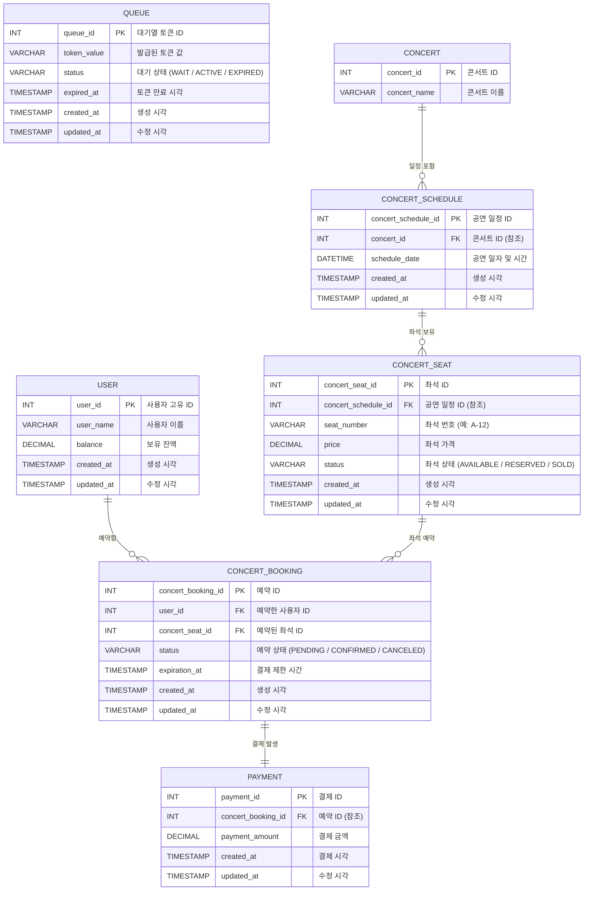

**[ ERD ]**

```mermaid
erDiagram
    USER {
        INT user_id PK "사용자 고유 ID"
        VARCHAR user_name "사용자 이름"
        DECIMAL balance "보유 잔액"
        TIMESTAMP created_at "생성 시각"
        TIMESTAMP updated_at "수정 시각"
    }

    QUEUE {
        INT queue_id PK "대기열 토큰 ID"
        VARCHAR token_value "발급된 토큰 값"
        VARCHAR status "대기 상태 (WAIT / ACTIVE / EXPIRED)"
        TIMESTAMP expired_at "토큰 만료 시각"
        TIMESTAMP created_at "생성 시각"
        TIMESTAMP updated_at "수정 시각"
    }

    CONCERT {
        INT concert_id PK "콘서트 ID"
        VARCHAR concert_name "콘서트 이름"
    }

    CONCERT_SCHEDULE {
        INT concert_schedule_id PK "공연 일정 ID"
        INT concert_id FK "콘서트 ID (참조)"
        DATETIME schedule_date "공연 일자 및 시간"
        TIMESTAMP created_at "생성 시각"
        TIMESTAMP updated_at "수정 시각"
    }

    CONCERT_SEAT {
        INT concert_seat_id PK "좌석 ID"
        INT concert_schedule_id FK "공연 일정 ID (참조)"
        VARCHAR seat_number "좌석 번호 (예: A-12)"
        DECIMAL price "좌석 가격"
        VARCHAR status "좌석 상태 (AVAILABLE / RESERVED / SOLD)"
        TIMESTAMP created_at "생성 시각"
        TIMESTAMP updated_at "수정 시각"
    }

    CONCERT_BOOKING {
        INT concert_booking_id PK "예약 ID"
        INT user_id FK "예약한 사용자 ID"
        INT concert_seat_id FK "예약된 좌석 ID"
        VARCHAR status "예약 상태 (PENDING / CONFIRMED / CANCELED)"
        TIMESTAMP expiration_at "결제 제한 시간"
        TIMESTAMP created_at "생성 시각"
        TIMESTAMP updated_at "수정 시각"
    }

    PAYMENT {
        INT payment_id PK "결제 ID"
        INT concert_booking_id FK "예약 ID (참조)"
        DECIMAL payment_amount "결제 금액"
        TIMESTAMP created_at "결제 시각"
        TIMESTAMP updated_at "수정 시각"
    }

%% ─────────────────────────────
%% 관계 설정
%% ─────────────────────────────
    USER ||--o{ CONCERT_BOOKING : "예약함"
    CONCERT ||--o{ CONCERT_SCHEDULE : "일정 포함"
    CONCERT_SCHEDULE ||--o{ CONCERT_SEAT : "좌석 보유"
    CONCERT_SEAT ||--o{ CONCERT_BOOKING : "좌석 예약"
    CONCERT_BOOKING ||--|| PAYMENT : "결제 발생"
```