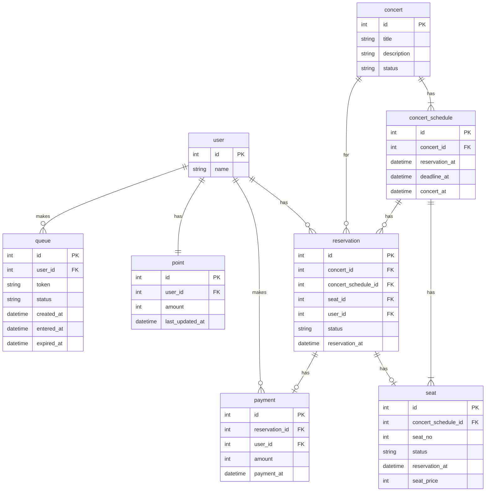

```mermaid
erDiagram
    user ||--o{ reservation : has
    user ||--o{ payment : makes
    user ||--|| point : has
    user ||--o{ queue : makes
    concert ||--|{ concert_schedule : has
    concert ||--o{ reservation : for
    concert_schedule ||--|{ seat : has
    concert_schedule ||--o{ reservation : has
    reservation ||--o| seat : has
    reservation ||--o| payment : has

    concert {
        int id PK
        string title
        string description
        string status
    }
    concert_schedule {
        int id PK
        int concert_id FK
        datetime reservation_at
        datetime deadline_at
        datetime concert_at
    }
    seat {
        int id PK
        int concert_schedule_id FK
        int seat_no
        string status
        datetime reservation_at
        int seat_price
    }
		
    reservation {
        int id PK
        int concert_id FK
        int concert_schedule_id FK
        int seat_id FK
        int user_id FK
        string status
        datetime reservation_at
    }

    payment {
        int id PK
        int reservation_id FK
        int user_id FK
        int amount
        datetime payment_at
    }

    point {
        int id PK
        int user_id FK
        int amount
        datetime last_updated_at
    }

    queue {
        int id PK
        int user_id FK
        string token
        string status
        datetime created_at
        datetime entered_at
        datetime expired_at
    }
    user {
        int id PK
        string name
    }
```
