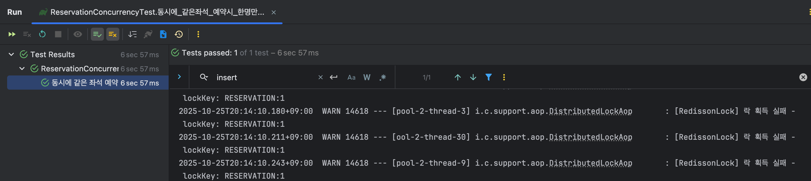

## 동시성 문제 & 분산 락(레디스)

- 특정 유저가 특정 공연(Concert), 특정 회차(Schedule), 특정 좌석(Seat)을 예약한다.
- API 는 동시에 여러 사용자가 같은 좌석을 찍을 수 있다. (예: 인기 좌석 첫 줄 자리)
- 같은 좌석은 한 명만 성공해야 한다.

## 문제 상황(장애 상황)

**ReservationConcurrencyTest** 에서 30개의 쓰레드가 동시에 같은 좌석을 예약 하도록 호출
```java
int threadCount = 30;
// ...
ReservationResult result = reservationFacade.reservation("RESERVATION:" + seatId, command);
```
### 기대: 
- 성공한 에약은 1건

### 실제:
- DB에 동일한 좌석으로 예약 row가 다수 Insert되는 현상 발생 
  - 1차 시도 17건, 2차 시도 29건
- 테스트 검증에서 expected = 1 but was 29 와 같이 실패
> 즉 서로 다른 사용자들이 사실상 동시에 같은 좌석을 잡는 "중복 예약" 상태가 일어남

## 왜 이런 문제가 발생했나?

### 1. 애플리케이션 레벨에서 코드가 동시에 실행됨
```java
public ReservationResult reservation(String lockName, ReservationCommand command) {
    
    ConcertSchedule schedule = concertService.getSchedule(command.scheduleId());
    
    Seat seat = concertService.getSeat(command.seatId());
    
    concertService.validateReservationAvailability(schedule, seat); // 좌석 가능 여부 체크
    
    concertService.assignmentSeat(seat); // 좌석 점유 처리
    
    Reservation reservation = reservationService.reservation(schedule, seat, command.userId());
    
    return ReservationResult.from(reservation, schedule, seat);
}
```
문제는 이 전체가 동시에 여러 쓰레드에서 실행되면
- 스레드 A와 스레드 B가 동시에 seat 상태를 조회한다. -> 둘 다 "AVAILABLE"
- 둘 다 assignmentSeat()를 호출
- 둘 다 reservation insert
> 즉 seat 점유 상태 변경이 다른 스레드에게 반영되기 전에 다음 스레드도 똑같은 좌성을 예약한다.

### 2. 트랜잭션 커밋 타이밍 때문에 DB에도 아직 반영 안됨
assignmentSeat()로 seat 상태를 UNAVAILABLE로 변경해도, 그건 트랜잭션이 커밋되기 전까지는 DB 밖(다른 트랜잭션)에서는 안보인다.
-> 그래서 거의 동시에 들어온 요청들은 서로 "아직 좌석이 비어있음"이라고 본다.

### 3. 결과적으로 동시성 제어가 전혀 안됨
JPA 단위 @Transactional만으로는 동시에 달려드는 요청을 순서대로 직렬화해주지 못한다. 동일 seatId에 대해서 순서를 강제로 보장해줘야 했다.

## 적용
### 1. AOP 기반 분산락 애노테이션 생성
```java
@DistributedLock(key = "#lockName")
@Transactional
public ReservationResult reservation(String lockName, ReservationCommand command) {
    // 좌석 조회 / 검증 / 점유 / 예약 생성
}
```
"RESERVATION:" + seatId 를 lockName으로 전달해서 같은 좌석이면 같은 락 키를 공유하도록 함
### 2. AOP 내부 동작 
```java
String key = "LOCK:" + ...; // 좌석마다 유니크한 락 키
RLock rLock = redissonClient.getLock(key);

boolean available = rLock.tryLock(waitTime, leaseTime, timeUnit);
if (!available) {
    throw new CoreException(ErrorType.LOCK_ACQUISITION_FAILED, key);
}

// 실제 비즈니스 로직 실행
Object result = aopForTransaction.proceed(joinPoint);

if (available && rLock.isHeldByCurrentThread()) {
    rLock.unlock();
}
```
- tryLock()이 true인 스레드 1개만 안으로 들어감
- 나머지 스레드는 false 또는 대기 후 예외 발생
- 예약 로직이 한 번에 한 명만 실행

### 3. 트랜잭션 정합성 문제 🔥
```text
[AOP 락 획득] → [@Transactional 시작] → [비즈니스 로직 실행] → 
[@Transactional 커밋 전] → [AOP finally 블록에서 락 해제]
```
락이 먼저 풀리고 나서 DB 트랜잭션이 커밋되는상황이 발생
- 스레드 A가 seat상태를 UNAVAILABLE로 업데이트 했지만 아직 커밋 전
- 락이 풀렸으니 스레드 B가 진입
- B가 seat을 조회하면 아직 "AVAILABLE" 상태로 보임(A의 변경사항 미 커밋)
- B도 예약 성공 -> 중복 발생

> 락을 트랜잭션 커밋 이후 풀자 <br> 즉, 락 해제 시점을 단순히 finally 블록이 아닌, 커밋이 끝난 이후(after commit)로 옮겨야 한다.
```java
finally {
        if (lockAcquired && rLock.isHeldByCurrentThread()) {
        TransactionSynchronizationManager.registerSynchronization(new TransactionSynchronizationAdapter() {
            @Override
            public void afterCommit() {
                try {
                    rLock.unlock();
                    log.info("[RedissonLock] 락 해제 완료 - lockKey: {}", lockKey);
                } catch (Exception e) {
                    log.warn("[RedissonLock] 이미 해제된 락 또는 스레드 불일치 - lockKey: {}", lockKey);
                }
            }
        });
    }
}
```

## 검증
### 1. Lock이 적용되지 않은 경우와, 트랜잭션 정합성 보장하지 않은 경우의 테스트
```text
threadCount = 30
동시에 같은 seatId 예약
성공 count ≈ 17 ~ 29
```
즉 같은 좌석이 여러 번 예약됨 -> 치명적 버그

### 2.Lock + 좌석상태 반영 후 테스트
```java
assertThat(successResults.size()).isEqualTo(1);
```
- 수정 전 29건 -> 수정 후 1건
- 나머지 스레드는 예외(CoreException:LOCK_ACQUISITION_FAILED 또는 좌석 불가) 처리

### ReservationConcurrencyTest
```java
    @DisplayName("동시에 같은 좌석 예약 요청 시, 한 명만 성공")
    @Test
    public void 동시에_같은좌석_예약시_한명만_성공 () throws InterruptedException {
        //given
        Long concertId = 1L;
        Long concertScheduleId = 1L;
        Long seatId = 1L;

        int threadCount = 30;
        ExecutorService executorService = Executors.newFixedThreadPool(threadCount);
        CountDownLatch latch = new CountDownLatch(threadCount);

        List<ReservationResult> successResults = Collections.synchronizedList(new ArrayList<>());

        //when
        for (int i = 0; i < threadCount; i++) {
            long userId = i;
            executorService.submit(() -> {
                try {
                    ReservationCommand command = ReservationCommand.builder()
                            .userId(userId)
                            .concertId(concertId)
                            .scheduleId(concertScheduleId)
                            .seatId(seatId)
                            .build();

                    ReservationResult result = reservationFacade.reservation("RESERVATION:" + seatId, command);
                    successResults.add(result);
                } catch (Exception e) {
                    throw new RuntimeException(e);
                } finally {
                    latch.countDown();
                }
            });
        }
        latch.await();
        executorService.shutdown();

        //then
        assertThat(successResults.size()).as("같은 좌석에 대해서는 한명만 예약 성공해야 함").isEqualTo(1);
    }
}
```


